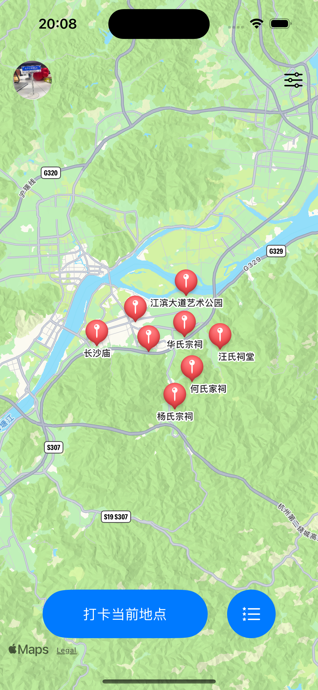
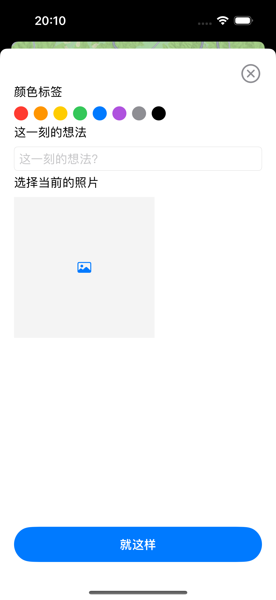
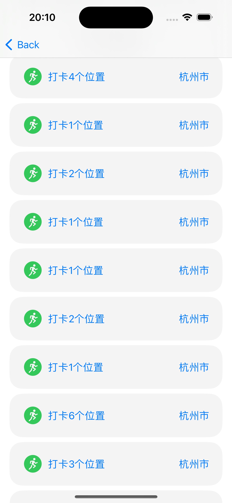

# City-Walk 需求文档

## 登录

### 1. 背景和目标

用户登录后，可以记录和管理所有操作，提供个性化服务。

### 2. 设计稿

暂无

### 3. 功能说明

1. **邮箱验证码登录**：用户输入邮箱后获取验证码，输入 6 位数验证码后点击登录按钮进行登录。

   - 前端需要对表单进行校验，确保输入正确。

2. **新用户识别**：登录后，后端判断用户是否为新用户，返回字段中标识。如果是新用户，需要进一步完善信息和头像。

   - 用户需填写用户名和上传头像。
   - 用户名需要校验是否重复。
   - 用户可选择 1 ～ 3 个喜欢的游玩类型，便于后续推荐（待定）。

### 4. 基本样式

## 首页

### 1. 背景和目标

这是最重要的页面，需覆盖所有主要操作，提供最佳用户体验。

### 2. 设计稿

暂无

### 3. 功能说明

:::warning
如有任何不合理之处，或有更好的建议，请随时提出。
:::

1. **全屏地图显示**：地图以用户当前位置为中心，显示当前省份的打卡记录。用户拖动地图时，中心点会改变，需判断省份是否改变，如改变则重新渲染新的打卡记录。

   - 前端需限制请求频率，避免地图拖动时频繁请求接口。

2. **推荐地点**：动态渲染以中心点为坐标的附近游玩地点，依据用户注册时选择的类型推荐，每次推荐 25 个。拖动地图改变中心点时，重新渲染推荐地点。

   - 前端需限制请求频率，拖动停止后 xxx 毫秒再调用接口。
   - 后端可使用第三方服务（如谷歌地图、百度地图、高德地图）获取周边推荐地点，根据需求和价格选择服务。

3. **地图标记模式切换**：

   - 显示当前省份打卡点和附近推荐地点。
   - 显示全球所有打卡点，隐藏推荐地点。
   - 仅显示推荐地点。

4. **打卡功能**：用户在当前位置打卡，点击后弹出表单填写弹窗，所有内容均为非必填项。弹窗内容包括：

   - 标题。
   - 颜色分类，选择一个颜色代表当前地点信息。
   - 简短文字输入框。
   - 图片上传，仅限一张图片（后端考虑上传到 OSS）。
   - 确认按钮，文案：“就这样”，可考虑更创新的设计或文案。

5. **打卡经验值**：不同的打卡方式获得不同经验值。

| 打卡方式                 | 经验值 |
| ------------------------ | ------ |
| 直接打卡                 | 20     |
| 添加标题                 | 30     |
| 添加标题和颜色分类       | 35     |
| 添加标题、颜色分类、图片 | 50     |

6. **解锁版图**：用户打卡可解锁当前省份的版图。中国有 34 个省份直辖市特别行政区，用户在新省份打卡解锁该省份版图，作为成就标识。用户解锁所有版图后可获得额外成就或奖励（如实际奖品，待定）。

   - 需防止用户使用非正常手段达成成就。
   - 初期仅面向中国市场，其他国家暂不考虑。

7. **排行榜**：根据用户打卡经验值生成排行榜，每周结算一次。前三名需有特殊样式，并获得金、银、铜奖杯成就。

   - 排行榜排名依据待定：当前所在省份排名？跨省排名？

8. **头部设计**：左侧显示用户头像，可进入个人主页，右侧有设置页面的图标。

9. **底部设计**：包含打卡按钮、排行榜按钮等。底部可上滑，上滑后地图逐渐模糊，显示彩蛋或成就等内容。

10. **反馈与建议**：欢迎对以上内容提出任何改进建议，协助我们完善产品。

### 4. 基本样式

## 排行榜

### 1. 背景和目标

通过经验值排名，每周更新，前三名获得奖杯。

### 2. 设计稿

暂无

### 3. 功能说明

### 4. 基本样式

## 设置

### 1. 背景和目标

用于用户信息的编辑和产品设置等。

### 2. 设计稿

暂无

### 3. 功能说明

1. **模块命名**：该模块或许不叫“设置”，需考虑其他名称替代，因为不仅仅包含设置内容。

2. **设置内容**：

   - 信息设置：头像、名字、签名。
   - 团队相关信息：交流群、𝕏、Github。
   - 其他：赞助、好评、推荐给他人。
   - 账户：退出登录。

3. **样式设计**：希望设置页面采用大胆的设计方式，而非传统的一行行列表展示。

### 4. 基本样式

## 查看信息

### 1. 背景和目标

查看用户信息、热力图、成就和步行记录。

### 2. 设计稿

暂无

### 3. 功能说明

### 4. 基本样式

## 会员

### 1. 背景和目标

产品的收入来源之一。

### 2. 设计稿

暂无

### 3. 功能说明

1. **会员试用**：新用户注册后，可享受 7 天或其他时长的会员体验。

2. **会员套餐**：提供 1 周、1 个月（31 天）和永久三种套餐，价格不宜过高，永久会员建议定价几十元。

3. **会员弹窗**：会员功能以弹窗形式从下至上展示。
