# 需求文档

## 登录

### 1. 背景和目标

登录后方便记录用户所有行为和操作，提供个性化服务。

### 2. 设计稿

暂无

### 3. 功能说明

1. **邮箱验证码登录**：用户输入邮箱后获取验证码，输入 6 位数验证码后点击登录按钮进行登录。

   - 前端需对表单进行校验，确保输入正确，校验邮箱是否格式正确和验证码是否为 6 位数

2. **新用户识别**：登录后，后端判断用户是否为新用户，返回字段中标识。如果是新用户，需要进一步完善信息和头像。

   - 用户需填写用户名和上传头像。
   - 用户名需校验是否重复。
   - 用户可选择 1 ～ 3 个喜欢的游玩类型分类，便于后续推荐。这块选择类似于你下载了一个音乐软件，让你选择你喜欢的歌手，那么进入之后就会优先推荐你喜欢的歌手的音乐，再夹杂着一些其它你可能喜欢的音乐。（待定）

   > 比如可以分类为：爬山、小众、游乐场、徒步、寺庙、古迹、自然……

3. **其它登录方式**：最好也可以支持一些其它的登录方式，比如微信、QQ，因为这里可能涉及到没有权限获取，有可能不行，可以先看一下。

### 4. 基本样式

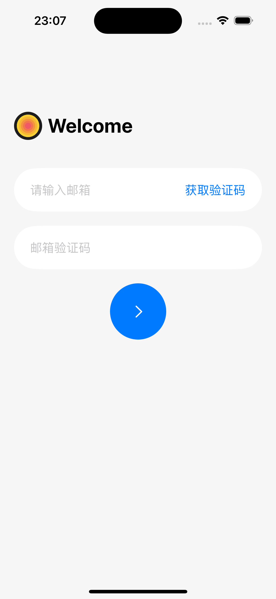
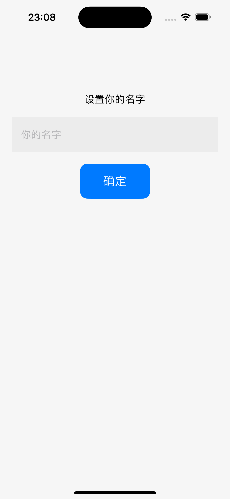
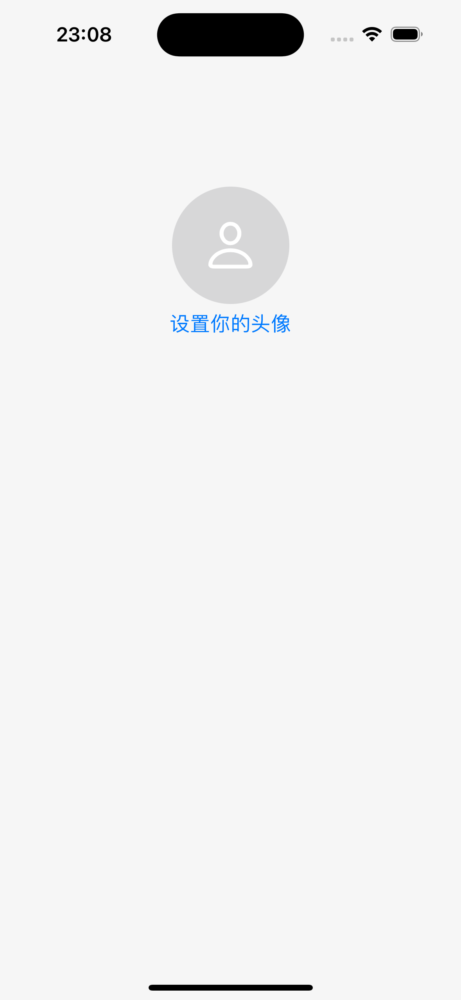

## 首页

### 1. 背景和目标

最重要的页面，需覆盖所有主要操作，提供最佳用户体验。

### 2. 设计稿

暂无

### 3. 功能说明

1. **首页样式（方案一）**：地图以用户当前位置为中心，显示当前省份的打卡记录。用户拖动地图时，中心点会改变，需判断省份是否改变，如改变则重新渲染新的打卡记录。

   - 前端需限制请求频率，避免地图拖动时频繁请求接口。
   - 推荐地点：动态渲染以中心点为坐标的附近游玩地点，依据用户注册时选择的类型推荐，每次推荐 25 个。拖动地图改变中心点时，重新渲染推荐地点。
   - 前端需限制请求频率，拖动停止后 xxx 毫秒再调用接口。
   - 后端可使用第三方服务（如谷歌地图、百度地图、高德地图、携程推荐）获取周边推荐地点，根据需求和价格选择服务。
   - 这个地图希望是像是动画一样，因为我们这不是一个地图软件，直接将默认地图样式放上来和主题完全不符合，下面是我找到的一个类似想要的风格：

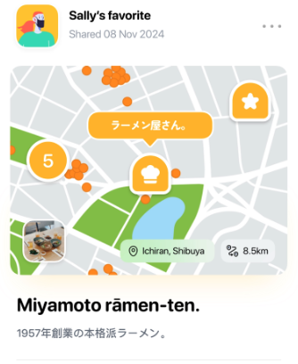
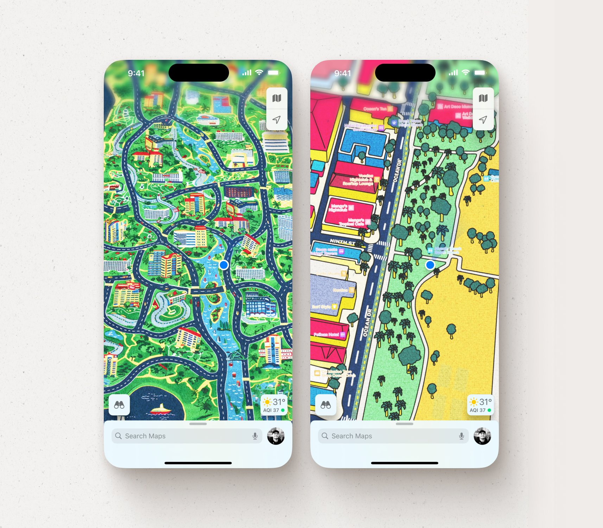

2. **首页样式（方案二）**：考虑换一种交互方式，不直接将整个地图放在首页，可以做一种独特的交互方式，比如之前考虑过将当前用户的省份版图放在首页，底部再来一些交互的按钮，或者参考[Soul](https://www.soulapp.cn)首页的星球设计方案，类似这样：

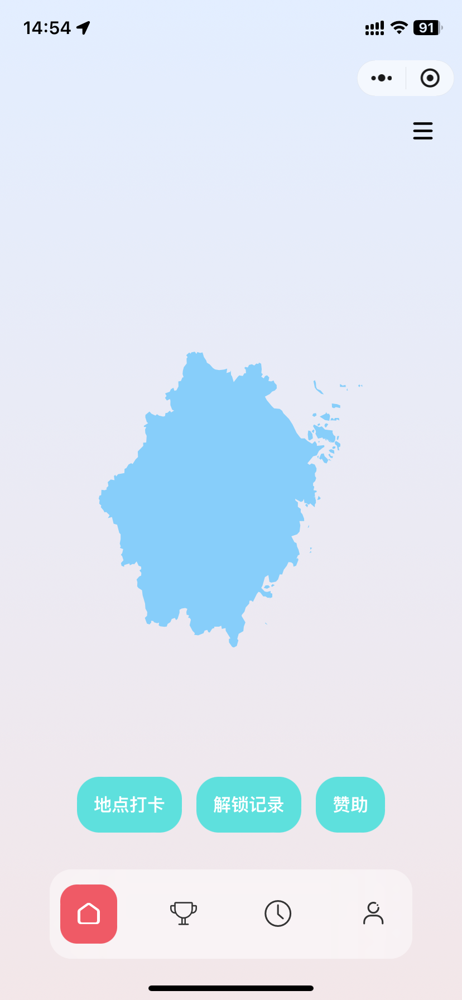
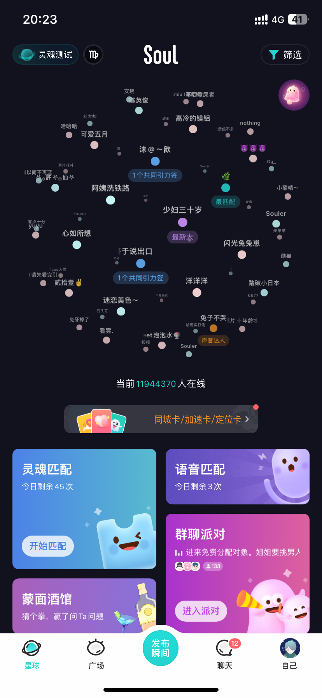

3. **打卡功能（方案一）**：用户在当前位置打卡，点击后弹出表单填写弹窗，所有内容均为非必填项。弹窗内容包括：

   - 标题，填写一段想要说的内容。
   - 颜色分类，选择一个颜色代表当前地点或者心情状态。
   - 图片上传，仅限一张图片（后端考虑上传到 OSS）。
   - 确认按钮，文案：“就这样”，可考虑更创新的设计或文案。

4. **打卡功能（方案二）**：用户在当前位置打卡，点击后即可算作打卡成功，成功会跳转到成功的落地页，里面内容包括：

   - 标注当前打卡位置。
   - 提示打卡成功。
   - 一些说明文案比如：这是你 xxxx 年在 xx 打卡的 xx 个地点。
   - 增加“发布瞬间”按钮，点击可以选择相册上传或者拍照上传图片。
   - 标题，填写一段想要说的内容。
   - 颜色分类，选择一个颜色代表当前地点或者心情状态。
   - 底部是“就这样”按钮。

5. **打卡经验值**：不同的打卡方式获得不同经验值（暂定数值），确定的是打卡完善不同的内容所获得的经验值是不一样的。

| 打卡方式                 | 经验值 |
| ------------------------ | ------ |
| 直接打卡                 | 20     |
| 添加标题                 | 30     |
| 添加标题和颜色分类       | 35     |
| 添加标题、颜色分类、图片 | 50     |

6. **解锁版图**：用户打卡可解锁当前省份的版图。中国有 34 个省份直辖市特别行政区，用户在新省份打卡解锁该省份版图，作为成就标识。用户解锁所有版图后可获得额外成就或奖励（如实际奖品，待定）。

   - 需防止用户使用非正常手段达成成就，比如挂 VPN 或者其它改变位置信息的方式。
   - 初期仅面向中国，其他国家暂不考虑。
   - 用户如何可以获得版图？在当前省份打卡，会获得在当前省份的经验值，当用户在这个省份获取的经验值到达 xx 的时候，可以解锁成就，由于每个省份的游玩地点有多有少，而且地理面积不一致，可以设定每个省份需要获得的经验值会有所不同。再获得版图之后持续打打卡，将会持续升温版图样式。

   > 举个例子：如果在浙江省，需要打卡到 2000 经验值，可获得版图，获得的版图是绿色的。如果再继续打卡，到达 3000 经验值，版图会升温变为黄色，共有有 5 个等级，也就是说再获得版图之后，可以有四次升温的计划，直到最终变为中国红色。

7. **首页其它组件**：用户的头像、天气气温、设置按钮、打卡按钮、排行榜按钮。

   - 用户头像点击会进入用户详情页面。
   - 作为旅行主题的软件，当天的天气和气温会直接影响出行的方式，所以需要。
   - 设置按钮会跳转到设置页面。
   - 打卡按钮，主要操作都在这个按钮上，可以快速打卡位置。
   - 排行榜，进入排行榜页面，会展示当前的排名，也会是比较常用的操作。

### 4. 基本样式

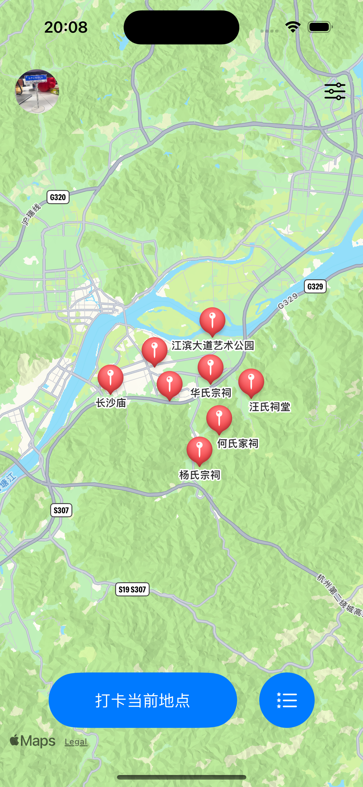
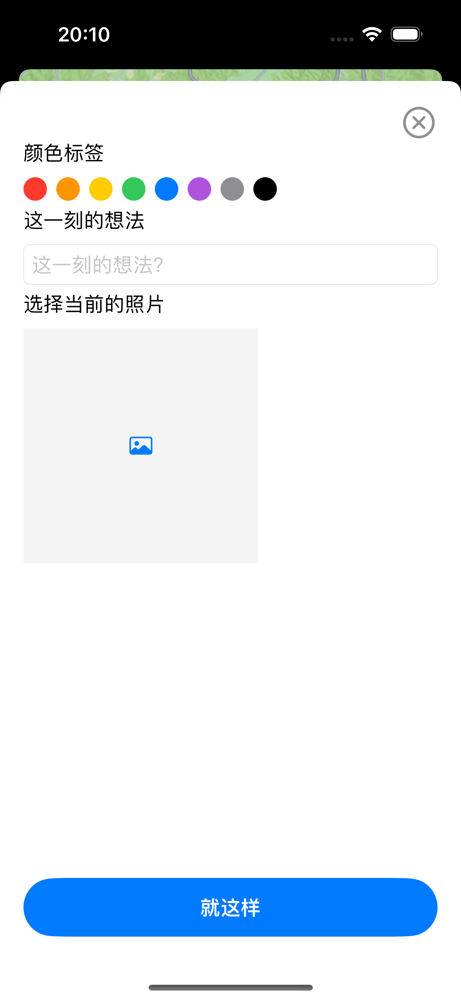

## 排名

### 1. 背景和目标

通过经验值排名，每周更新，前三名获得奖杯。

### 2. 设计稿

暂无

### 3. 功能说明

1. **周榜单**：每周更新经验值排名，前三名会获得金、银、铜奖杯。奖杯会显示在用户主页上，提升用户的成就感。

   - 根据用户打卡经验值生成排名，每周结算一次。前三名需有特殊样式，并获得金、银、铜奖杯成就。
   - 这里要注意的是：排名只计算用户本周所获的的经验值，对比的是不当前省份总共的经验值。

2. **奖励机制**：每周排名结算时，前三名可以获得奖励，如虚拟奖杯、实物奖品（待定）等。

   - 除了获得到成绩奖杯，还会获得额外经验值奖励，比如前三名是依次递减的经验值奖励，前 50 名会活得一小部分的经验值奖励。
   - 如果初期人数较少，如果榜单第一名的人只活得了 20 经验值，那么则不触发奖励机制，要求必须在周经验值 100 以上的，在奖励范围内的人才可以活得奖励。
   - 经验值为 0 的人不会出现在榜单上。
   - 榜单最多只显示 100 人。
   - 如果当前用户在 100 名之外，会在最后显示 TA 自己，排名显示 100+，并给一段鼓励的话，让 TA 继续加油打卡之类的。
   - 排名排名依据待定：当前所在省份排名？跨省排名？
   - 为了使大家更加在意这个排行，排名靠前除了获得到成就奖杯之外，还会获得经验奖励，比如前三名分别可以获得在当前省份的版图经验值增加 600、300、100，前 50 名可以获得 20 经验。（奖励的经验值可以后续再确定具体的数值）

### 4. 基本样式

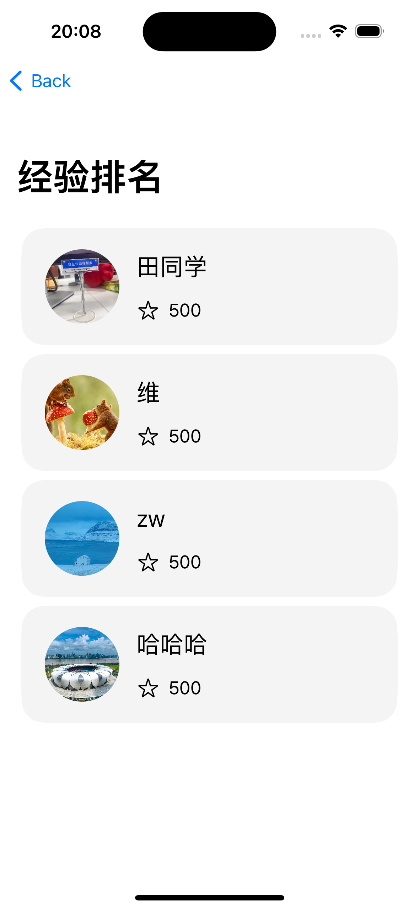

## 设置

### 1. 背景和目标

用于用户信息的编辑和产品设置等。

### 2. 设计稿

暂无

### 3. 功能说明

1. **模块命名**：该模块或许不叫“设置”，需考虑其他名称替代，因为不仅仅包含设置内容。

2. **设置内容**：

   - 信息设置：头像、名字、签名。
   - 团队相关信息：交流群、𝕏、Github。
   - 其他：赞助、好评、推荐给他人。
   - 账户：退出登录。

3. **样式设计**：希望设置页面采用大胆的设计方式，而非传统的一行行列表展示。

### 4. 基本样式

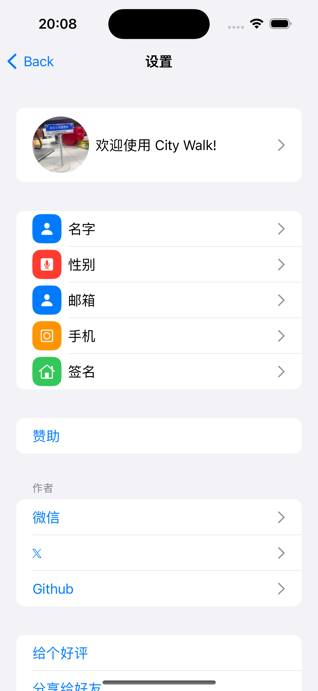

## 我的

### 1. 背景和目标

查看用户信息、热力图、成就和步行记录。

### 2. 设计稿

暂无

### 3. 功能说明

1. **用户主页**：展示用户头像、昵称、签名等基本信息。

2. **热力图**：展示用户近一年的每天获得到的经验值统计，每天获得到的越多，每天对应的小方块颜色就会越深。

   - 这里需要带有分享功能，分享用户的热力图信息，生成图片分享。图片上携带者产品名称、Logo、用户信息和热力图，并且加上一段推荐语。
   - 每次进入用户首页热力图自动滚动到当前月份的位置。

3. **成就展示**：展示用户解锁的成就和奖杯，包括打卡成就、排名奖杯等。

   - 如果有成就，则显示，没有则不显示。

4. **步行记录**：展示用户的步行轨迹和打卡记录。

   - 不希望是普通的列表展示形式，希望可以换一种新颖的形式。

5. **省份版图**：展示用户获得的所有版图，并且展示不同的经验颜色状态。

6. **分享**：将用户所获的的成就增加可分享查看的功能。

   - 点击当前解锁的省份版图可以查看详情，是一个弹窗，弹窗里面有当前省份版图、解锁日期、经验值，分享按钮。点击分享按钮可生成一张海报图，可以分享到微信和其它平台，也可以保存到手机上。
   - 点击步行记录也可以分享，分享这一天所走的路线和打开的地点。也是生成一张图片来分享到其它平台，也可以保存到手机上。

### 4. 基本样式

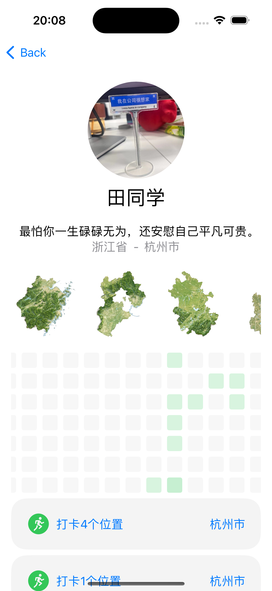

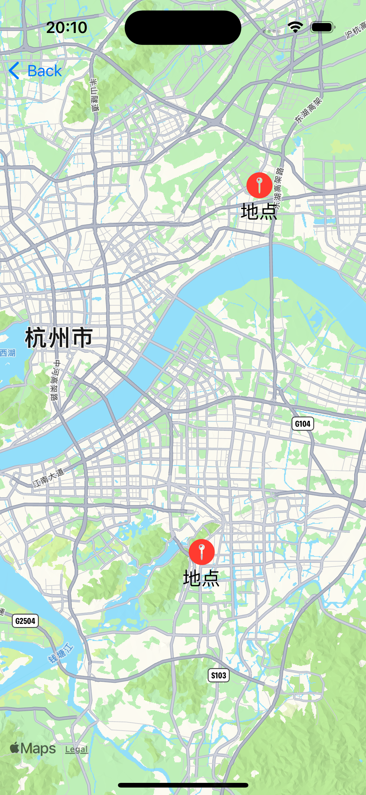

## 会员

### 1. 背景和目标

产品的收入来源之一。

### 2. 设计稿

暂无

### 3. 功能说明

1. **会员试用**：新用户注册后，可享受 7 天或其他时长的会员体验。

2. **会员套餐**：提供 1 周、1 个月（31 天）和永久三种套餐，价格不宜过高，永久会员建议定价几十元。

3. **会员弹窗**：会员功能以弹窗形式从下至上展示。

4. **会员特权**：

   - **打卡加成**：会员用户打卡时可获得额外经验值。
   - **地图特权**：会员可解锁更多地图显示模式和特殊标记。
   - **数据备份**：会员享有数据备份和恢复功能。
   - **专属标识**：会员用户在排名和个人主页上有特殊标识。
