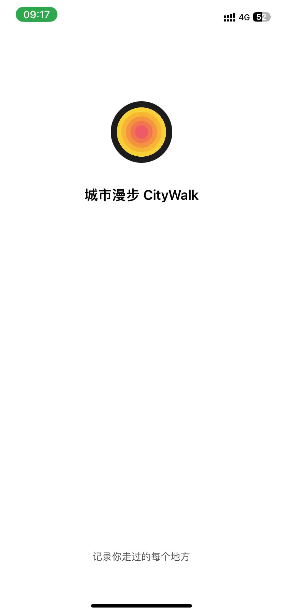

# 需求文档

## 整体介绍

用户下载 App 之后，首先需要获取网络权限。完成简单快捷的注册流程后，用户需要选择三个感兴趣的地点类型。

进入首页时，应用会请求获取定位权限。用户授权后，地图的中心点会变为用户当前所在的位置，并推荐周边可能感兴趣的地点。首页下方提供了打卡、邀请等操作按钮。用户可以直接对当前位置进行打卡，打卡成功后会跳转到成功的落地页，用户可以选择文案、心情颜色、出行方式，上传照片等来完善打卡详情。不同的完善情况将获得不同的经验值。

首页的邀请按钮可以邀请好友成为你的好友，用户可以查看好友的经验值排名，并相互查看对方的信息。邀请好友也会获取到额外的经验值。

进入“我的”页面后，用户可以查看个人信息，包括头像、昵称、签名等，还可以查看近一年的热力图以及所有的打卡记录。

## 备注

- 如果有任何不符合的地方或者更好的建议，欢迎随时提出。
- 划掉的内容暂时不做或已废弃。

## 页面进入顺序

1. 首次打开，未登录状态：启动页 -> 首次引导 -> 登录页 -> 首页。
2. 非首次打开，未登录状态：启动页 -> 登录页 -> 首页。
3. 非首次打开，未登录状态：启动页 -> 登录页 -> 首页。
4. 非首次打开，登录状态：启动页 -> 首页。

## 原型文档

http://test.tianyuhao.cn/model/city-walk/index.html

## 启动页

### 一. 背景和目标

在启动之前可以做一些预加载，避免直接进入首页数据还未加载完成，造成用户体验不好。

### 二. 设计稿

暂无

### 三. 功能说明

1. **内容**：需要有 Logo 和 Slogan。

### 四. 设计参考

暂无

### 五. 基本样式

## 登录注册

### 一. 背景和目标

登录后方便记录用户所有行为和操作，提供个性化服务。

### 二. 设计稿

暂无

### 三. 功能说明

1. **第一步-输入邮箱**：提供输入邮箱的输入框，和一个确认按钮，当前确认提交之后，跳转到输入邮箱验证码步骤。这里的不需要页面跳转，全部都在一个页面完成，使用步骤进行实现。

   - 引导标题：“你好，请登录”。
   - 进入页面默认获取输入框焦点，弹起英文输入的键盘。
   - 前端需要做邮箱格式的表单校验。
   - 点击确认按钮之后，等待接口响应的时候按钮需要禁用。
   - 获取成功之后跳转到第二步输入验证码。
   - 考虑：是否需要生成图形验证码？二次确认，以免是机器人或者程序操控登录。在输入图形验证码之后，再跳转到输入验证码的步骤。

2. **第二步-输入验证码**：用户输入邮箱后获取验证码，输入 6 位数验证码后点击登录按钮进行登录。

   - 引导标题：“请输入验证码”。
   - 进入页面默认获取输入框焦点，弹起数字输入的键盘。
   - 前端需对表单进行校验，确保输入正确，校验邮箱是否格式正确和验证码是否为 6 位数。
   - 验证码输入的方式是放 6 个小输入框，每个输入框输入 1 位数字。
   - 提供“重新获取”和“确认提交”的按钮。
   - 点击重新获取的话，会重新获取验证码，但是获取冷却时间是 60 秒。（前端做限制，最好后端也做限制，因为就算前端做了限制，还是可以通过 postman 等工具一直调用获取，因为这个接口没有身份验证。后端也需要考虑，如何检测到有人恶意调用，可以禁止当前 ip 的功能）。
   - 点击“确认提交”按钮会进入到下一个步骤或者首页。后端需要在登录成功的返回字段中返回 `is_new_user` 的布尔字段，判断当前是否为新用户，如果是新用户就继续跳转到第三步，如果不是新用户，则跳转到首页。
   - 检测验证码输入 6 位数之后，自动触发提交，在提交过程中按钮禁用。

3. **第三步-选择偏好**：用户需要选择 1 ～ 3 个喜好的地点类型。

   - 引导标题：“你的偏好”。
   - 用户选择喜好的类型，便于后续首页地点推荐。这块选择类似于你下载了一个音乐软件，让你选择你喜欢的歌手，那么进入之后就会优先推荐你喜欢的歌手的音乐，再夹杂着一些其它你可能喜欢的音乐。比如可以分类为：爬山、小众、游乐场、徒步、寺庙、古迹、自然、骑行……
   - 底部有确认按钮，点击提交成功之后跳转到首页，必须至少选择 1 个偏好，如果一个都没有选择，按钮禁用。
   - 点击提交按钮禁用，响应成功之后跳转到首页。
   - 这一步看似很关键，会影响后续的地点推荐，有可能用户直接退出当前步骤，造成这一项确实，不够没关系，在设置页面中预留了补充“选择偏好”的入口，方便后续更改。

### 四. 基本样式

## 首次引导

### 一. 背景和目标

只在首次打开软件的时候才会有，如果在引导页面的过程中退出并且强制关闭软件，则不会再一次引导。

使用三个引导页面让用户快速了解产品的主要内容和使用方式。引导页面使用 logo 渐进式动画引导（动画和交互正在设计中）。

每一页中要有一个插画动图、主题文案、主题色、下一步的按钮。

三页使用横向滑动或者渐隐的方式切换。

### 二. 设计稿

暂无

### 三. 功能说明

1. **第一步**：

   - 背景颜色：主题色，或者橙色。
   - 主题文案：欢迎来到 City Walk。
   - 按钮文案：耶。点击之后跳转到第二页。

2. **第二步**：

   - 背景颜色：白色。
   - 主题文案：这里可以打卡走过的每个地点。
   - 按钮文案：好的。点击之后跳转到第三页。

3. **第三步**：

   - 背景颜色：logo 背景的黑色。
   - 主题文案：记录你走过的每个地方。
   - 按钮文案：开始吧。点击之后跳转到首页。

### 四. 设计参考

- [引导大概样式参考](https://x.com/helloalzea/status/1804063284032868778)
- [引导的按钮风格，很大的](https://x.com/helloalzea/status/1804075665031073812)

## 首页

### 一. 背景和目标

这是最重要的页面，需要覆盖所有主要操作，提供最佳用户体验。背景为整个世界地图，定位当前用户所在的位置，屏幕可见区域上面 2/3 显示地图，下面 1/3 显示功能部分，功能部分悬浮在地图上。功能部分包含：打卡、邀请、我的好友、排名、回到当前位置、天气和气温功能。

功能部分可向上拖动，底部会显示一些今日的历史打卡记录：如果有打卡地点，显示今日已打卡地点；没有则显示今日未打卡，占位图显示。

地图上需要标识用户当前位置和推荐地点，推荐地点先显示 10 个。

希望首页能加入 Logo 元素。

### 二. 设计稿

暂无

### 三. 功能说明

1. **组件和内容**：地图背景、推荐地点、用户头像、设置按钮、邀请好友、好友列表、打卡按钮、回到当前位置按钮、Logo 元素、排行榜按钮、天气和气温、底部滑动的更多内容。

   - 地图背景：显示用户当前位置标识，并且显示其它推荐地点样式，用户位置要相比其它推荐地点更加突出。点击推荐的地点可以弹出小的悬浮框，显示地点的详细信息，会有一个导航按钮，点击的话可以弹出选择使用高德地图、地图、百度地图，查看到这里的路线。
   - 用户头像：点击会进入用户详情页面。
   - 设置按钮：点击会进入设置页面。
   - 邀请好友：点击会进入邀请页面。加个隐藏操作，长按可以直接复制邀请链接，并且给 toast 提示：“邀请链接已复制”。
   - 推荐的地点：地图上会以当前用户为中心，推荐 10 个可以去的地点。如果用户选择了便好地点，则按照便好设置推荐 6 个地点，其它随机地点推荐 4 个。如果没有选择偏好，则全部随机推荐。点击推荐的地点可以查看位置详情，并且有导航按钮，点击的话提示使用其它第三方地图软件去导航到这里。
   - 好友列表：点击进入好友列表页面。
   - 打卡按钮：首页最重要的按钮，希望更加靠近屏幕右侧，因为放在右侧用户可以更加方便点击。希望上面可以加入 Logo 元素，可以将 Logo 元素作为动态的类似于呼吸灯一样慢慢扩散的效果放在打卡按钮上。希望首页格外突显这个按钮。上面文案可以是“打卡”。这里希望加入一个小细节：获取手机的陀螺仪，logo 元素可以在打卡按钮中缓慢的晃动。
   - 回到当前位置按钮：当用户拖动地图之后，如果用户头像不在可见区域内了，那么显示该按钮；如果用户头像在屏幕可见区域内，则显示该按钮。点击按钮之后，地图改变以用户为中心点的位置。
   - Logo 元素：首页最好可以突显出产品的主题色，主题色禁止是蓝色系！最好是和 Logo 相呼应，自由、放松的色系。
   - 排行榜按钮：点击进入排行榜页面。
   - 天气和气温：显示当天的天气和气温。天气使用 icon 图标代替。需要的 icon 包括：晴天、多云、下雨、下雪等。
   - 底部滑动的更多内容：首页下面 1/3 可以向上拖动，向上拖动之后，地图会有一个蒙层，逐渐模糊。向上拖动会显示下面更多的内容。如果今天有打卡记录，则显示今天所有的打卡地点，如果今天还没有打卡记录，则显示一个空状态，一个展位图和一段文字：“今天还没有打卡地点哦”。

2. **开发**：全屏显示地图，地图以用户当前位置为中心点，地图上会标记一些地点标识，是推荐的地点，拖动地图停下来的时候会再次以地图中心点为坐标获取周边推荐的地点。

   - 前端需限制请求频率，避免地图拖动时频繁请求接口。
   - 推荐地点：动态渲染以中心点为坐标的附近游玩地点，依据用户注册时选择的类型推荐，每次推荐 10 个。拖动地图改变中心点时，重新渲染推荐地点。如果进行缩放，根据比例增加，具体增加多少后面可以参考实际效果和第三方服务的支持情况。
   - 后端可使用第三方服务（如谷歌地图、百度地图、高德地图、携程推荐）获取周边推荐地点，根据需求和价格选择服务。

3. **申请提示**

   - 通过扫码用户邀请二维码或者分享链接进入，则弹窗提示：”xx 申请加你为好友，你同意吗？“。提供：同意、拒绝、暂不处理三个按钮。

     - 弹窗里要显示申请人的头像。
     - 点击同意，toast 提示“添加成功”。
     - 点击拒绝，toast 提示”拒绝成功“。
     - 点击暂不处理，则直接关掉对话框，在好友列表中会显示未处理的好友申请，可以再次操作。

4. **其它**：

   - 如果没有允许位置权限需要申请权限。
   - 没有网络和没有位置权限的 toast 提示。
   - 地图主题颜色：在 6:00 ～ 18:00 显示浅色主题，18:00 ～ 6:00 显示深色主题。
   - 考虑如何将地图风格设计的不那么像是地图软件。
   - 在未登录的状态下，点击需要登录的内容都给 toast 提示：“登录后再尝试”，并且跳转到登录页面。
   - 增加一个备用的弹窗，可以后端远程控制内容的。方便后期有维护提示、升级提示等操作。

### 四. 设计说明

**对视觉要求以及交互会要求高一些，一定要注意这一点。希望偏向于国外 IOS App 设计风格。**

- 使用 Figma 设计。
- 扁平化设计风格。
- 国外 IOS 设计风格。
- 推荐使用毛玻璃效果。
- 避免使用蓝色系主题风格。

### 五. 设计参考

:::warning
以下仅供设计参考，并非直接照搬！
:::

- [卡片带有毛玻璃效果的细节](https://x.com/greeenyang/status/1803593644546592818)，可以将文字放在毛玻璃上面，以免图片和图片混合在一起比较乱。
- [类似的地图参考](https://x.com/Valentin_Fgrs/status/1800180932714131688)
- [带有地图的](https://x.com/helloalzea/status/1795004564590227762)

Soul 首页底部卡片设计参考：

### 六. 基本样式

## 邀请

### 一. 背景和目标

前期需要累积更多的用户，增加用户的粘性，形成一张用户网，后期可以让好友之间进行互动、分享等。

比如排行榜模块，用户可能根本不会去和世界上所有人的排名去比，如果排名里面都是自己的身边的朋友，才会相互去比较和分享，大家只会关注一些自己的圈子。

第一版的邀请可能会做的比较重一些。

### 二. 设计稿

暂无

### 三. 功能说明

1. **入口**：目前有两个入口，可以在首页、朋友页进入邀请页面。

2. **邀请方式**：目前有两种邀请方式，分别是链接邀请和二维码邀请。

   - 进入邀请页面会生成一张海报图，海报图希望的简介一些，带有 Logo、Slogan 和二维码，如果当前扫码用户没有下载 app，则会跳转到 App Store 下载，下载完成之后再扫码则会打开软件，首页会提示是否添加 xx 为好友。如果二维码不好做的话，第一期可以先不做，先放一个可以直接跳转 Apple Store 的二维码提供下载即可。
   - 页面底部有两个按钮，分别是“复制分享链接”和“分享海报图”，点击之后可以选择分享的其它第三方平台，QQ、微信、小红书。

### 四. 设计参考

- [极简的，类似这样的插画风格](https://x.com/openpurpose/status/1809286136256426146)

## 朋友列表

### 一. 背景和目标

查看到我的好友列表，可以查看好友详情。

### 二. 设计稿

暂无

### 三. 功能说明

1. **我的好友**：我加的好友会在这里显示出来，点击好友可以查看 TA 的详情。

   - 不能查看好友的步行记录详细信息，只能看到列表。

2. **邀请好友**：要有邀请好友的入口，点击进入邀请页面。

3. **未处理的申请**：如果首页好友申请点了”暂不处理“，这里要显示未处理的申请列表。

   - 需要显示头像、申请时间、同意按钮、拒绝按钮。

     - 点击同意，则同意好友申请。将该条申请在未处理的列表中移除。并且在好友列表中展示出新加的好友。
     - 点击拒绝，则拒绝好友申请。并且将该条申请在未处理的列表中移除。

### 四. 设计参考

暂无

## 打卡成功

### 一. 背景和目标

打卡成功的落地页，可以进一步完善当前打卡细节，如：文案、图片、心情颜色、出行方式等。

### 二. 设计稿

暂无

### 三. 功能说明

1. **打卡功能**：用户在当前位置打卡，点击后即可算作打卡成功，成功会跳转到成功的落地页，里面内容包括：

   - 当前省份版图。
   - 提示语句。
   - 发布瞬间：可以选择一张照片。
   - 颜色分类，选择一个颜色代表当前地点或者心情状态。
   - 出行方式：公交、地铁、自行车、步行、开车、火车、飞机、船。
   - 地点位置：可以选择当前地点详细位置。
   - 说点什么：可以输入一段简短的文案。
   - 底部是“就这样” 按钮。

   > 考虑填写内容的时候，不要让用户感觉有太多的内容填写，感觉会让用户有反感，最好可以从设计层面解决，可以让用户逐渐接受。

2. **打卡经验值**：不同的打卡方式获得不同经验值（暂定数值），确定的是打卡完善不同的内容所获得的经验值是不一样的。以下数值仅供参考：

| 打卡方式                 | 经验值 |
| ------------------------ | ------ |
| 直接打卡                 | 20     |
| 添加标题                 | 30     |
| 添加标题和颜色分类       | 35     |
| 添加标题、颜色分类、图片 | 50     |

3. **解锁版图**：用户打卡可解锁当前省份的版图。中国有 34 个省份直辖市特别行政区，用户在新省份打卡解锁该省份版图，作为成就标识。用户解锁所有版图后可获得额外成就或奖励（如实际奖品，待定）。

   - 需防止用户使用非正常手段达成成就，比如挂 VPN 或者其它改变位置信息的方式。
   - 初期仅面向中国，其它国家暂不考虑。
   - 用户如何可以获得版图？在当前省份打卡，会获得在当前省份的经验值，当用户在这个省份获取的经验值到达 xx 的时候，可以解锁成就，再获得版图之后持续打打卡，将会持续升温版图样式。

   > 举个例子：如果在浙江省，需要打卡到 200 经验值，可获得版图，获得的版图是绿色的。如果再继续打卡，到达 3000 经验值，版图会升温变为黄色，共有有 5 个等级，也就是说再获得版图之后，可以有四次升温的计划，直到最终变为中国红色。希望的是，用户可以很快获得版图，但是升温会比较难一些。

4. **头部信息**：包含当前打卡省份版图元素，根据当前经验值展示不同的效果，会有一段说明文案，根据当前的解锁程度或者经验值来改变：

   - 如果还未获得版图，版图是灰色的，文案：还需要再获得 xx 经验值才能获得版图。
   - 如果当前打卡正好获取经验值，版图从灰色变为绿色，文案：恭喜你成功解锁 xx。
   - 如果当前已经获得版图了，版图还未升温的状态，文案：再获得 xx 经验版图将会升温。
   - 如果获得经验值正好升温了版图，版图将有一个升温的过度动画，文案：恭喜你升温了 xx。

   > 待思考：用户获得多少经验值可以获得版图？

### 四. 设计参考

- [参考查看详情和编辑](https://x.com/fabiangruss/status/1808952134806761773)

### 五. 基本样式

## 排名

### 一. 背景和目标

进入页面显示的是好友的经验排行榜，带有一个可以进入省份排名的入口。

好友的经验排名每天更新，经验值从高到低排序，但是不需要有过于明显的排名，可以参考微信运动，可以经验值到 500+ 颜色为橙色，其它后面的都是绿色字体（举个例子，当然可以选适合的颜色）。第一名将会置顶突出显示，就像微信运动，第一名的封面会显示到最上面一样的感觉。整个好友排行榜，样式不要让用户有过于谁高谁低的感觉，以免产生心理落差感，略微点缀即可。

### 二. 设计稿

暂无

### 三. 功能说明

1. **更新时间**：每天 22:00 更新榜单，和微信运动一致。

2. **奖励机制**：初期可以先没有，可能人数较少，希望每个人好友人数能达到 10+之后再增加该功能。

   - 具体奖励什么，可以后续再思考。

### 四. 设计参考

- [在排行榜中点击其它人的头像，使用这样的毛玻璃效果展示用户信息](https://x.com/handhelddesign/status/1804167563460645218)

### 五. 基本样式

## 设置

### 一. 背景和目标

用于用户信息的查看和产品信息等。

### 二. 设计稿

暂无

### 三. 功能说明

1. **模块命名**：该模块或许不叫“设置”，需考虑其它名称替代，因为不仅仅包含设置内容。

2. **设置内容**：

   - 信息相关：头像、名字、签名、选择偏好。

     - 名字长度为 1-16。
     - 签名长度 1-30。
     - 选择偏好和新用户首页登录选择的交互类似，以免用户在选择偏好的时候当时是随便选择的，或者没有选择直接退出，造成选项丢失的问题。这里预留一个修改的入口，方便随便选择的，或者未选择的用户进行修改。

   - 团队相关：交流群、𝕏、Github。
   - 产品相关：赞助、好评、推荐给他人。
   - 其它：退出登录。

3. **样式设计**：希望设置页面采用大胆的设计方式，而非传统的一行行列表展示。

4. **编辑信息**：信息相关的内容可以进行编辑，点击弹窗输入编辑的内容。比如点击了签名，那么弹窗框里面输入框内容默认是签名内容。

   - 底部提供确认按钮，点击按钮之后按钮禁用，接口响应成功之后关闭弹窗。

### 四. 基本样式

## 我的

### 一. 背景和目标

查看用户信息、热力图、成就和步行记录。

### 二. 设计稿

暂无

### 三. 功能说明

1. **用户主页**：展示用户头像、昵称、签名等基本信息。

2. **热力图**：展示用户近一年的每天获得到的经验值统计，每天获得到的越多，每天对应的小方块颜色就会越深。

   - 这里需要带有分享功能，分享用户的热力图信息，生成图片分享。图片上携带者产品名称、Logo、用户信息和热力图，并且加上一段推荐语（看实现难度，可以先不做）。
   - 每次进入用户首页热力图自动滚动到当前月份的位置。

3. **步行记录**：展示用户的步行轨迹和打卡记录。

   - 不希望是普通的列表展示形式，希望可以换一种新颖的形式。
   - 每个步行记录外面标识：出行方式的 icon、打卡地点的数量、日期。
   - 点击可以查看步行记录详情，跳转到详情页面。

4. **省份版图**：展示用户获得的所有版图，并且展示不同的经验颜色状态。

5. **分享**：将用户所获的的成就增加可分享查看的功能（可以先不做）。

   - 点击当前解锁的省份版图可以查看详情，是一个弹窗，弹窗里面有当前省份版图、解锁日期、经验值，分享按钮。点击分享按钮可生成一张海报图，可以分享到微信和其它平台，也可以保存到手机上。
   - 点击步行记录也可以分享，分享这一天所走的路线和打卡的地点。也是生成一张图片来分享到其它平台，也可以保存到手机上。

### 四. 设计参考

- [个人首页，左侧的图](https://x.com/eremkaragoz/status/1809234197057355845)

### 五. 基本样式

## 打卡记录详情

### 一. 背景和目标

查看某一天我走过的路线详情，我发布的图片和文案。

### 二. 设计稿

暂无

### 三. 功能说明

1. **地图上显示打卡地点**：标记打卡地点，点击可以查看当前地点的详情，包括当时拍摄的照片、文案、出行方式等

### 四. 设计参考

- [参考查看详情](https://x.com/fabiangruss/status/1808952134806761773)
- [过渡动画](https://x.com/RaajeevChandran/status/1807747773841788977)

## 会员（先不做）

### 一. 背景和目标

产品的收入来源之一。

### 二. 设计稿

暂无

### 三. 功能说明

1. **会员试用**：新用户注册后，可享受 7 天或其它时长的会员体验。

2. **会员套餐**：提供 1 周、1 个月（31 天）和永久三种套餐，价格不宜过高。

3. **会员弹窗**：会员功能以弹窗形式从下至上全屏展示。

4. **会员特权**：

   - 打卡加成：会员用户打卡时可获得额外经验值。
   - 专属标识：会员用户在排名和个人主页上有特殊标识。
   - 专属图标：会员用户可享受专属 app 图标。

   > 待考虑：
   >
   > 字数限制：非会员地点打卡紫薯限制 xx，会员用户限制 1000
   >
   > 打卡限制：非会员每天最多打卡 6 次，会员可无限打卡
   >
   > 样式自定义：会员可联系客服自定义个人首页的背景样式
   >
   > 其它...
